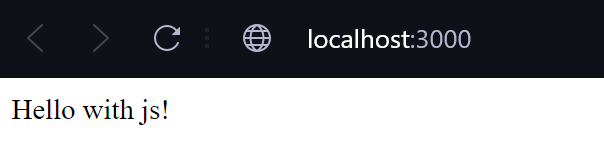

# Hello with JS
## 🥇Scope
<p align="center">
    
</p>
This program to print the messages "Hello with JS" in the languaje Javascrip.

## 📑Instalation
**1.** Clone the Repository
   ```
    git clone https://github.com/Karolpineda/proyect_js.git
   ```

**2.** Once the project has been cloned, you must open it with the VSCode code editor.

**3.** You can run of the proyect en el button ▶️

## 🐳 How to run in docker

### Pre-requisites
* Docker - DockerDesktop installed
* DockerHub account

**1.** Download image and run the following command in a terminal.
   ```
    docker push karolpineda/proyect_js:v1
   ```
**2.**  Finally, you can run the imagen with the folling command.
   ```
docker run -p 3000:3000 karolpineda/proyect_js:v1

   ```

> [!IMPORTANT]
> By default of python we use the port 3000. If it is required to deploy it on a different port, only 3000 must be modified for another desired port.

## 🔍 View the results
[View results](#scope)

## 🔍 View in Railway
[Click me](https://proyectjs-production.up.railway.app/)
<p align="right">
By. Karol Pineda
</p>